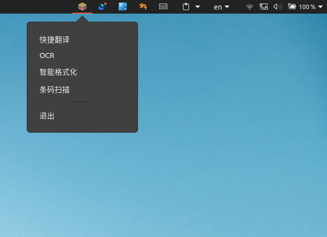

# Fastray

linux 下可配置的自定义 AppTray

方便在 appTray 里面唤起各种工具或者自定义命令

帮你省区各种快捷键记忆 ~~(其实是小工具太多了我的快捷键已经不够用了)~~


## 截图


## 配置
在可执行文件目录下的 .conf/config.json
配置格式如下

```json
{
    "IconPath": "/home/ericwyn/Pictures/icons/fastray.png", // 图标配置
    "Commands": [
		{
			"ItemName": "快捷翻译", // item 名称
			"ItemID": "eze-trans", // item id
			"ItemCommand": "/home/ericwyn/chaos/go/EzeTranslate/EzeTranslate -x" // item 命令
		},
		{
			"ItemName": "OCR",
			"ItemID": "eze-trans-ocr",
			"ItemCommand": "/home/ericwyn/chaos/go/EzeTranslate/EzeTranslate -ocr"
		},
		{
			"ItemName": "智能格式化",
			"ItemID": "eze-format",
			"ItemCommand": "/home/ericwyn/dev/go/EzeFormat/EzeFormat"
		},
		{
			"ItemName": "条码扫描",
			"ItemID": "bar-scan",
			"ItemCommand": "/usr/bin/scann"
		}
	]
}
```